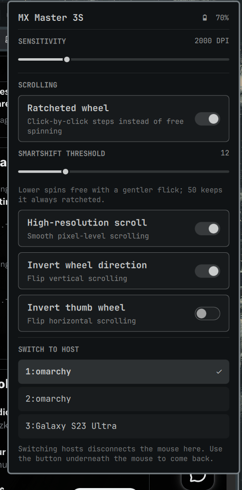

# MX Master — Omarchy bar plugin

Bar widget and panel for configuring a Logitech MX Master mouse from the
Omarchy bar. Shows battery in the bar; the panel exposes sensitivity, scroll
behaviour and host switching.



## Requirements

- [Solaar](https://github.com/pwr-Solaar/Solaar) (`pacman -S solaar`) — provides
  both the `solaar` CLI and the `logitech_receiver` Python module.
- A Logitech mouse on a Unifying/Bolt receiver, over Bluetooth, or by cable.

No root access is needed: the receiver's `/dev/hidraw*` node is already
user-writable via udev/ACL on Omarchy.

## Install

```bash
git clone https://github.com/kevin/omarchy-mxmaster.git \
  ~/.config/omarchy/plugins/kevin.mxmaster
omarchy plugin enable kevin.mxmaster
omarchy bar put kevin.mxmaster --section right
```

## What it controls

| Panel control | Solaar setting | Notes |
|---|---|---|
| Sensitivity | `dpi` | 200–8000 in steps of 50 |
| Ratcheted wheel | `scroll-ratchet` | Ratcheted vs. free spinning |
| SmartShift threshold | `smart-shift` | 1–50; how hard a flick breaks into free spin, 50 never does |
| High-resolution scroll | `hires-smooth-resolution` | Smooth pixel-level scrolling |
| Invert wheel direction | `hires-smooth-invert` | Vertical scroll direction |
| Invert thumb wheel | `thumb-scroll-invert` | Horizontal scroll direction |
| Switch to host | `change-host` | Moves the mouse to another paired machine |

Switching hosts disconnects the mouse from this machine. Press the small button
underneath the mouse to bring it back.

## How it works

`mx_ctl.py` is the only moving part:

- **Reads** (`status`) go through the `logitech_receiver` library so a single
  HID++ session returns battery and every setting at once (~3.5s, mostly
  receiver enumeration).
- **Writes** (`set`) shell out to `solaar config`, which owns the persistence
  path — it writes the device *and* records the value in
  `~/.config/solaar/config.yaml` so it is reapplied when the mouse reconnects.

Because a write costs ~2.5s, the widget updates optimistically and queues
changes, and the last known state is cached in
`~/.cache/omarchy-mxmaster.json` so the bar paints instantly at shell start
instead of waiting out the probe. Battery is polled every five minutes.

Solaar's GUI is not required and no daemon needs to run. If you do run the
Solaar GUI at the same time, prefer changing settings in one place at a time.

## Which mice does it work with?

Nothing here is specific to the MX Master 3S. The plugin picks the first
reachable device whose name matches `NAME_HINTS` in `mx_ctl.py`, and otherwise
falls back to any HID++ mouse, so another Logitech mouse is detected without
editing anything. Rows in the panel are driven by what the device actually
reports: each entry in `EXPOSED` is skipped silently when the mouse does not
implement it, so a cheaper model simply shows fewer controls (an M330 has no
SmartShift or thumb wheel, so those rows disappear).

The real limit is Solaar, not this plugin: the device has to speak HID++ 2.0 and
be supported by `logitech_receiver`. Very old or non-Logitech mice will show up
as "not detected".

Both connection styles work, and the difference matters:

- **Via a Unifying/Bolt receiver** — the device is reached by walking the
  receiver, and `serial` is populated.
- **Directly over Bluetooth or USB cable** — the device has no receiver to walk
  and reports an *empty* `serial` while only `unitId` is set.

Because `solaar config` matches its argument against serial, codename, kind or
name — never the unit id — the plugin selects by serial when there is one and
falls back to the codename otherwise. Settings are also stored per connection in
Solaar's config, so the same mouse can legitimately report different values on
the receiver than over Bluetooth.

A mouse that has gone to sleep answers `ping()` with `False` rather than `None`;
the panel reports it as not connected instead of showing a device whose settings
all read back empty.

## License

MIT
